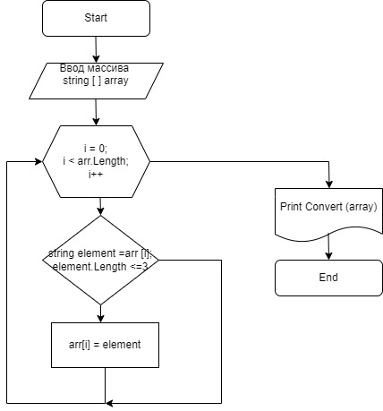

# *Задача*

Написать программу, которая из имеющегося массива строк формирует массив из строк, длина которых меньше либо равна 3 символа. Первоначальный массив можно ввести с клавиатуры, либо задать на старте выполнения алгоритма. При решении не рекомендуется пользоваться коллекциями, лучше обойтись исключительно массивами.

## Пример 
["hello", "2", "world", ":-)"] -> ["2", ":-)"]

["1234", "1567", "-2", "computer science"] -> ["-2"]

["Russia", "Denmark", "Kazan"] -> []

## **Блок-схема**

Ниже представлена блок-схема алгоритма решения поставленной задачи. 

## ***Описание решения***
1. *Первоначальный массив* с произвольными символами задаем на старте выполнения алгоритма.
2. Прописываем условие по ограничению выведения символов в *преобразованный массиве*.
3. Цикл с заданным условием переберет все символы первоначального массива. Символы соответствующие условию задачи выводятся в новый преобразованный массив.